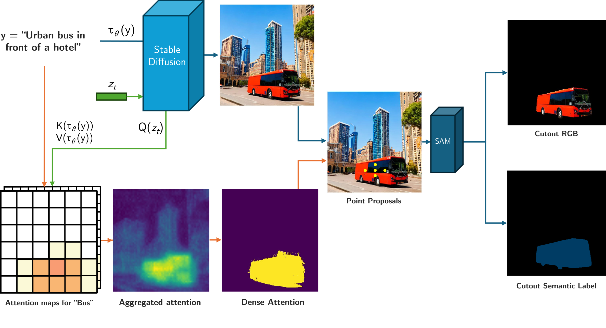

# Unsupervised Class Generation to Expand Semantic Segmentation Datasets

[](https://arxiv.org/abs/2501.02264)
[](https://doi.org/10.3390/jimaging11060172)


Semantic segmentation is a computer vision task where classification is performed at a pixel level. Due to this, the process of labeling images for semantic segmentation is time-consuming and expensive. To mitigate this cost there has been a surge in the use of synthetically generated data -- usually created using simulators or videogames -- which, in combination with domain adaptation methods, can effectively learn how to segment real data. Still, these datasets have a particular limitation: due to their closed-set nature, it is not possible to include novel classes without modifying the tool used to generate them, which is often not public. Concurrently, generative models have made remarkable progress, particularly with the introduction of diffusion models, enabling the creation of high-quality images from text prompts without additional supervision.

In this work, we propose an unsupervised pipeline that leverages Stable Diffusion and Segment Anything Module to generate class examples with an associated segmentation mask, and a method to integrate generated cutouts for novel classes in semantic segmentation datasets, all with minimal user input. Our approach aims to improve the performance of unsupervised domain adaptation methods by introducing novel samples into the training data without modifications to the underlying algorithms. With our methods, we show how models can not only effectively learn how to segment novel classes, with an average performance of 51% IoU, but also reduce errors for other, already existing classes, reaching a higher performance level overall.



## Note
**Huge thanks to [@pablomm](https://github.com/pablomm) for his ovam work and code, which we partially use as base for ours. All the code in /ovam folder belongs to him.**

## Installation
Create a new virtual or conda environment (if applicable) and activate it. For example, using `venv`:

```bash
# Install a Python environment (ensure 3.8 or higher)
python -m venv venv
source venv/bin/activate
pip install --upgrade pip wheel
```

Install PyTorch with a compatible CUDA or other backend and [Diffusers 0.20](https://pypi.org/project/diffusers/0.20.2/). In our experiments, we tested the code on Ubuntu with CUDA 11.8 and on MacOS with an MPS backend.

```bash
# Install PyTorch with CUDA 11.8
pip install torch==2.1.0 torchvision==0.16.0 torchaudio==2.1.0 --index-url https://download.pytorch.org/whl/cu118
```

```bash
# Or Pytorch with MPS backend for MacOS
pip install torch==2.1.0 torchvision==0.16.0 torchaudio==2.1.0
```

Clone project's code and install dependencies

```bash
git clone git@github.com:vpulab/ovam.git
cd ovam
pip install . # or `pip install -e .` for live installation
```

Or directly from GitHub

```bash
pip install git+https://github.com/vpulab/ovam.git
```

## Generating data

You can use the code from [generate_data_train.py](generate_data_train.py) to generate a dataset. Just change the prompt to those that fit your desired class.

You can use [dataset_cleaner.py](dataset_cleaner.py) to remove samples with unfit masks using the parameters from the paper. Feel free to tune those to those that best fit your use case.

## Training with this data:

We used mmseg pipeline to train in our UDA experiments. We include the pipeline used to load the diffusion crops into images at [mmseg_load_annotations.py](mmseg_load_annotations.py).

If you want to use it with mmseg include it at /mmseg/datasets/pipelines/loading.py and then reference it in your pipeline script (usually in configs/_base_/datasets/).

If you want to include it in your own code, check the code for the functions used to extract the masks and overlay those on the other images (and labels).
```python
if np.random.randint(0,100) < 5:
            #Get cutout
            cutout_filename = np.random.choice(self.cutouts)
            cutout_filename = cutout_filename.split(' \n')[0]

            #Load Cutout (specific from mmseg)
            img_bytes_cm = self.file_client.get(self.cutout_dataset_path+'ss/'+cutout_filename)
            cutout_mask = mmcv.imfrombytes(
                img_bytes_cm, flag='unchanged',
                backend=self.imdecode_backend).squeeze().astype(np.uint8)
            #Load RGB (specific from mmseg)
            img_bytes_crgb = self.file_client.get(self.cutout_dataset_path+'rgb/'+cutout_filename)
            cutout_rgb = mmcv.imfrombytes(
                img_bytes_crgb, flag='color', backend=self.imdecode_backend)
            #Convert mask to appropiate int
            cutout_mask = cutout_mask*16

            # Compute maximum position for random pasting
            max_y = results['img'].shape[0] - cutout_rgb.shape[0]
            max_x = results['img'].shape[1] - cutout_rgb.shape[1]


            # Randomly choose a position to paste the image
            y = np.random.randint(0, max_y)
            x = np.random.randint(0, max_x)

            #Paste and mask
            results['img'][y:y + 512, x:x + 512][cutout_mask>0] = cutout_rgb[cutout_mask>0]
            results['gt_semantic_seg'][y:y + 512, x:x + 512][cutout_mask>0] = cutout_mask[cutout_mask>0]
```

## Downloading datasets:

The datasets used in our paper can be found here: [Zenodo](https://doi.org/10.5281/zenodo.17117206), for the classes Train, Bus and Truck.

## Citation

Montalvo, J., García-Martín, Á., Carballeira, P., & SanMiguel, J. C. (2025). Unsupervised Class Generation to Expand Semantic Segmentation Datasets. Journal of Imaging, 11(6), 172.

```bibtex
@article{montalvo2025unsupervised,
  title={Unsupervised Class Generation to Expand Semantic Segmentation Datasets},
  author={Montalvo, Javier and Garc{\'\i}a-Mart{\'\i}n, {\'A}lvaro and Carballeira, Pablo and SanMiguel, Juan C},
  journal={Journal of Imaging},
  volume={11},
  number={6},
  pages={172},
  year={2025},
  publisher={MDPI}
}
```


